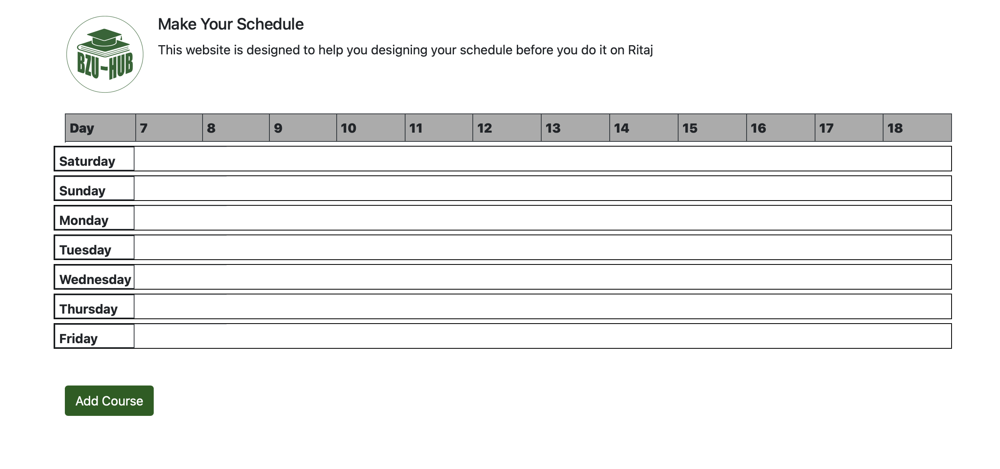

# Ritaj scheduler

this scheduler work as client side by the use of SESSION. you can add your subjects in horizental view and you can give it the color you want.
you can use this project to view your schedule of the semester in prettier way by colors.

If you found it helpful or interesting, could you please consider giving it a star on GitHub? Your support means a lot to me! ⭐
Thank you in advance! 🚀

